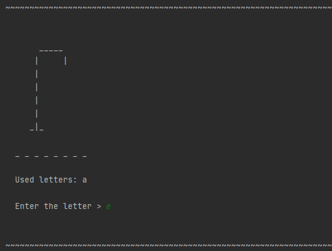
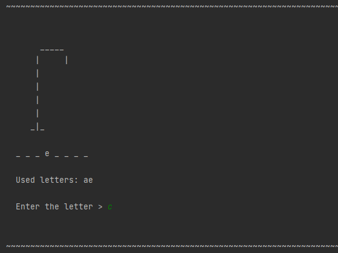
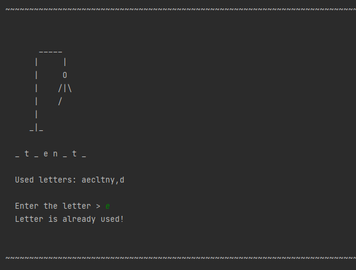
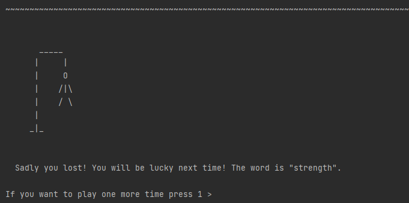
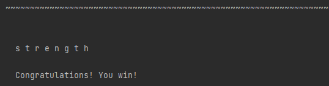

<h1 align="center">Hangman game</h1>

---

Hangman is a game for 1 player. PC generates a word that the player must guess      
by naming one letter at a time. With each mistake, a part of the gallows will       
be drawn. The goal is to guess the word before gallows will be completely drawn.

## Screenshots:

## If try used letter:

## If lost:

## If won:

